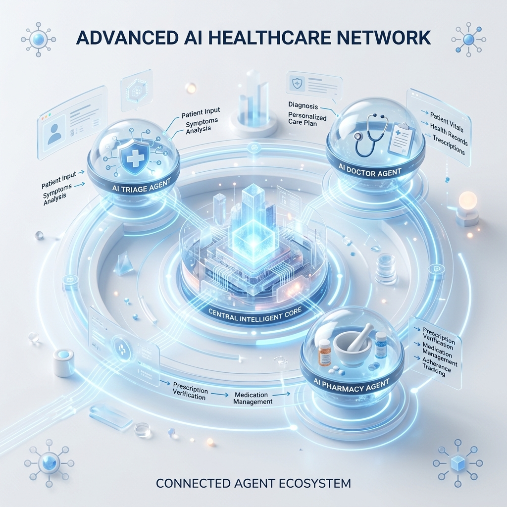
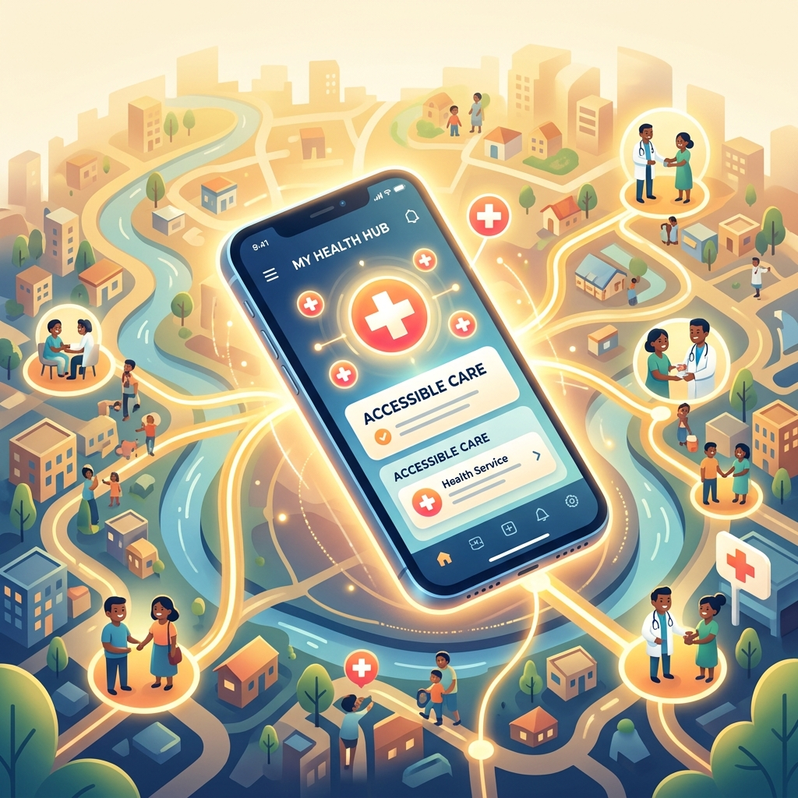

# Heal U AI
### Autonomous AI Medical Service Orchestrator
Team Submission | AISeekho 2026 Hackathon Challenge 2

---

## 1. Fragmented Healthcare in the Informal Economy

- **Accessibility Barriers:** Navigating complex medical care systems is overwhelming for users without technical or medical literacy.
- **Language Constraints:** Most platforms don't support natural conversational Urdu/Roman Urdu, alienating millions of users.
- **Fragmented Experience:** Chatbots, pharmacy apps, and doctor booking portals are completely disconnected from one another.

---

## 2. A Unified, Agentic Healthcare Companion

- **Natural Language Triage:** Describe symptoms in native conversational language (e.g., "Mujhe kal se shadeed sir dard hai").
- **Dynamic Actionable UI:** The AI doesn't just reply with text—it magically generates interactive UI cards to book doctors or order medicine right inside the chat.
- **Complete End-to-End Orchestration:** From initial symptom analysis to automated follow-up scheduling, everything happens in one place.

---

## 3. Key Features Designed for Scale

- **Multimodal Lab Report Analysis:** Users can snap a photo of physical lab reports and the AI extracts, analyzes, and diagnoses instantly.
- **Automated Ambulance Dispatch:** High-severity symptoms trigger a red-alert emergency protocol to dispatch local emergency services.
- **Hyper-Local Provider Matching:** Recommends the nearest, highest-rated doctors and pharmacies based on the user's city profile.
- **Stateful Medical Records:** Every chat, consultation, and medicine order is saved in a unified health dashboard.

---

## 4. Powered by Next-Generation Tech

---

## 4. Powered by Next-Generation Tech (Cont.)

- **Agentic Core:** Google Antigravity powers multi-agent delegation (Triage, Diagnosis, Provider Matching).
- **Frontend App:** Built with React Native (Capacitor/Expo) for a premium, cross-platform mobile experience.
- **State & Database:** Firebase Firestore handles real-time syncing and scheduling loops.
- **Mock Service APIs:** Deep integration with simulated structures modeled on real platforms.

---

## 5. The Agentic Workflow: How Heal U Acts

1. **Understand & Triage:** Identifies if the issue is a critical emergency or a standard consultation.
2. **Specialist Mapping:** Maps vague natural-language symptoms to exact medical specialities (e.g., Stomach Ache -> Gastroenterologist).
3. **Simulated Execution:** Filters local datasets and dynamically renders a seamless in-app booking overlay.
4. **Proactive Follow-ups:** Autonomously schedules and pushes check-in notifications after completion.

---

## 6. A Massive Uncharted Market Potential

---

## 6. A Massive Uncharted Market Potential (Cont.)

- **The Informal Economy:** Over 60% of the workforce operates here, representing millions needing language-native access.
- **B2B2C Expansion:** Heal U charges lead-generation fees to hospital networks and pharmacy chains for routing validated patients.
- **Scalability:** Agentic architecture can be scaled to new cities and APIs with zero UI redesigns.

---

## 7. Bringing Premium Healthcare to Everyone

---

## 7. Bringing Premium Healthcare to Everyone (Cont.)

- **Democratizing Care:** Bringing world-class medical routing to users who traditionally lack access.
- **Live API Integration:** Fully prepared to swap mock datasets with live, proprietary APIs from national health providers.
- **Wearable Integration:** Future phases can automatically pull data from smartwatches for live anomaly detection.
